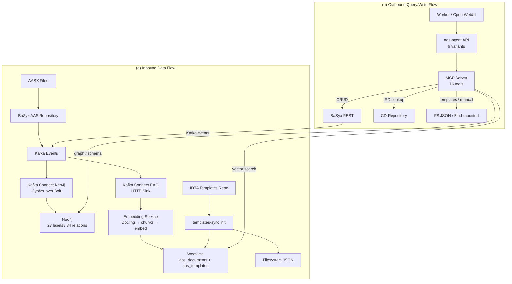

## Overview

BaSyx loads `.aasx` files → publishes Kafka events. Two Kafka Connect pipelines consume them: `kafka-connect-neo4j` builds a Neo4j graph (structure), `kafka-connect-rag` → `embedding-service` → extracts PDFs → chunks → embeds → stores in Weaviate (vectors). LangGraph agents call 16 MCP tools on port 8110 to query both stores and perform CRUD via BaSyx REST. All services on single bridge network `aas-network`.

---

## Architecture (Mermaid Draft)

---

## Service Inventory

| Port | Service | Role |
|---|---|---|
| 8090 | Open WebUI | Chat frontend; talks to aas-agent API only |
| 8120 | aas-agent | FastAPI, OpenAI-compatible API; 6 LangGraph agent variants |
| 8110 | AAS Hybrid MCP | FastMCP server; 16 tools across graph, vector, CRUD, templates, manual |
| 7474 | Neo4j Browser | AAS knowledge graph; read-only Cypher via MCP |
| 8070 | Weaviate HTTP | Vector store: manual chunks + template specs |
| 8000 | Embedding Service `/health` | Flask: PDF extraction (Docling), chunking, embedding, Weaviate write |
| 8099 | BaSyx GUI | AAS repository UI; REST API for CRUD via MCP |
| 8081 | BaSyx AAS Environment | BaSyx management UI |
| 6274 | MCP Inspector | MCP protocol debugging UI |
| 2181 | Zookeeper | Kafka coordination |
| 9092 | Kafka | Event bus for BaSyx → Neo4j/Embedding |

---

## Ingestion Data Flow

1. **AASX Upload**: Operator places `.aasx` files in `aasx/` → BaSyx AAS Environment loads them
2. **Kafka Event Emission**: Every create/update/delete emits a JSON event to `aas.repository.events.topic`
3. **Graph Pipeline** (kafka-connect-neo4j):
   - Consumer reads Kafka events
   - Transforms each event into Cypher statements
   - Executes over native Bolt protocol with buffering (40 MB, 20K node limit)
   - Result: 27 node labels, 34 relationship types, full AAS metamodel coverage
4. **Document Pipeline** (kafka-connect-rag → embedding-service):
    - Kafka events referencing AAS `File` elements trigger HTTP sink → embedding-service downloads PDF → Docling extracts text/layout → chunks with metadata → embeds → writes to Weaviate (`aas_documents_{model_slug}`)
5. **Template Pipeline** (templates-sync init container):
   - Clones IDTA submodel-templates repository → extracts JSON specs → ingests into Weaviate (`IdtaTemplateSpec`) AND writes filesystem JSON files for exact lookup

---

## Query/Write Data Flow

1. **User Input**: Worker asks maintenance question in Open WebUI
2. **Agent Routing**: `api.py` routes to variant based on `model` field (`aas-agent:react`, `aas-agent:plan`, etc.)
3. **Tool Execution**: Agent calls MCP tools:
   - `query_aas_graph()` → Neo4j (read-only Cypher, 1000-row cap)
   - `search_aas_documents()` → Weaviate (vector search, optional `submodel_id` filter)
   - `get_graph_schema()` → full node/relationship catalog for query generation
   - `get_manual_index()`/`get_manual_page()` → bind-mounted manual pages
   - `search_idta_templates()`/`get_template()`/`get_templates_index()` → Weaviate + filesystem JSON
    - `lookup_semantic_id()` → BaSyx CD-Repository API (IRDI → IEC 61360)
4. **Write Operations** (`put_*`/`delete_*`):
   - Metamodel validation via `basyx-python-sdk` deserialization
   - Template conformance check via generated Python classes
   - BaSyx REST call → triggers Kafka events → auto-sync back to Neo4j + Weaviate
   - Agent's next turn observes its own previous writes

---

## Agent Variants (6)

| Variant | Description |
|---|---|
| `aas-agent:react` | Baseline: ReAct tool-calling loop via `create_react_agent`; self-validating prompt built-in |
| `aas-agent:plan` | Plan-and-Reflect: structured planner → executor (bounded ReAct sub-loop) → reflector → finalizer |
| `aas-agent:crag` | Corrective RAG: executor → relevance evaluator → refine query → retry (up to `CRAG_MAX_REFINEMENTS`) → synthesizer |
| `aas-agent:reflexion` | Self-improvement: executor → judge → reflect → retry (up to `REFLEXION_MAX_TRIALS`) with verbal feedback |

---

## MCP Tools (16)

| Category | Tool | Purpose |
|---|---|---|
| **Graph** | `query_aas_graph(cypher, params)` | Read-only Cypher over Neo4j AAS graph (1000-row cap) |
| **Graph** | `get_graph_schema()` | Full node/relationship catalog for Cypher generation |
| **Document** | `search_aas_documents(query, submodel_id?, limit?)` | Vector search with optional submodel-scope filter |
| **Manual** | `get_manual_index()` | List available manual pages |
| **Manual** | `get_manual_page(name)` | Load specific manual page on demand |
| **Template** | `search_idta_templates(query, name?, limit?)` | Natural-language template discovery (Weaviate) |
| **Template** | `get_templates_index()` | List all template specs (filesystem JSON) |
| **Template** | `get_template(name)` | Exact structural template lookup (filesystem JSON) |
| **Semantic** | `lookup_semantic_id(id)` | Resolve IRDI → IEC 61360 concept (BaSyx CD-Repository) |
| **CRUD** | `put_aas(aas_json)` | Create/update an AAS |
| **CRUD** | `delete_aas(id)` | Remove an AAS |
| **CRUD** | `put_submodel(aas_id, sm_json)` | Create/update a submodel (w/ template conformance check) |
| **CRUD** | `delete_submodel(aas_id, sm_id)` | Remove a submodel |
| **CRUD** | `put_submodel_element(sm_id, id_path, elem_json)` | Generic: covers all SubmodelElement subtypes |
| **CRUD** | `delete_submodel_element(sm_id, id_path)` | Remove a submodel element |
| **Time** | `get_current_utc_time()` | Current timestamp for log entries (agent-side) |
